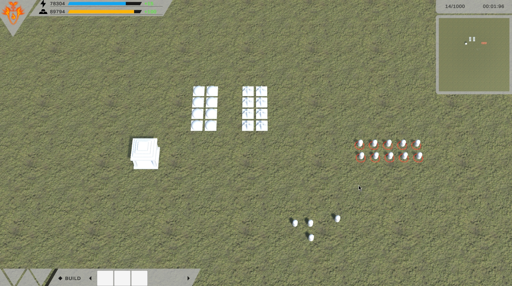
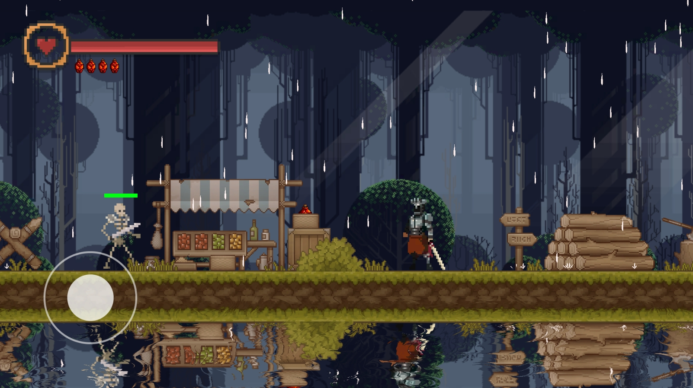

# 🎮 Unity Developer Portfolio

Привет! Я Юра - разработчик игр на Unity.

Здесь представлены проекты разработанные мной в процессе изучения Unity. За 2 года 4 месяца разработки в Unity я успел пополнить свое портфолио как простыми проектами, так и более серьезными работами с применением различных фреймворков. Проекты расположены в порядке от новых к старым.

## 🔥 Проекты

### Mystique Fusion (Цифкор)
**Описание:** Бесплатная крипто-игра.  
**Подробнее о проекте:** Мой первый коммерческий проект, участие в котором принимал на протяжении 10 месяцев  
**Подробнее:** [О проекте](https://github.com/ZloyGreGan/unity-developer/blob/main/projects/mystique_fusion/mystique_fusion.md)

---

### Тестовые задания

**Adaptation Project:** [О проекте/Исходники](https://github.com/ZloyGreGan/AdaptationProject)  
**BattleShips 3D:** [О проекте/Исходники](https://github.com/ZloyGreGan/BattleShipsTest)  
**Simple Mahjong 2D:** [О проекте/Исходники](https://github.com/ZloyGreGan/MahjongTestTask)  
**Цифкор:** [О проекте/Исходники](https://github.com/ZloyGreGan/Cifkor_TestTask)  

---

### RTS (Учебный проект)
**Описание:** Прототип RTS стратегии для ПК.  

  
Скриншоты: 

  

  
  

---

### Matrix Inventory
**Описание:** Мой первый матричный инвентарь.  

[YouTube](https://www.youtube.com/watch?v=swgBI3nZD3c)

---

### STOP (Проект для дипломной работы)
**Описание:** STOP - Головоломка основанная на уникальном концепте остановки времени.  
**Подробнее о проекте:** Игра, разрабатываемая для дипломной работы. Была выгружена в NashStore (Название: STOP)

  
Скриншоты: 

  

  
  
  
  
  

---

### Какой-то учебный проект
**Описание:** Игра из бесплатных ассетов, задача пройти всю карту и убить босса.  

  
Скриншоты: 

  

  
  

## 🛠 Стек технологий
- Unity 2D/3D (C#, UI Toolkit, UGUI, Addressables)  
- DI: Zenject, VContainer, MessagePipe
- Асинхронность: UniTask, UniRx, UnityWebRequest, async/await
- Анимации: DOTween  
- Архитектура: MVC, MVP, ECS, Clean Architecture(MVP), Assembly Definitions
- Управление задачами: Asana, Jira
- VCS: Git

📬 **Связаться со мной:** [VK](https://vk.com/zloygregan) | [Telegram](https://t.me/Zloy_GreGan)
