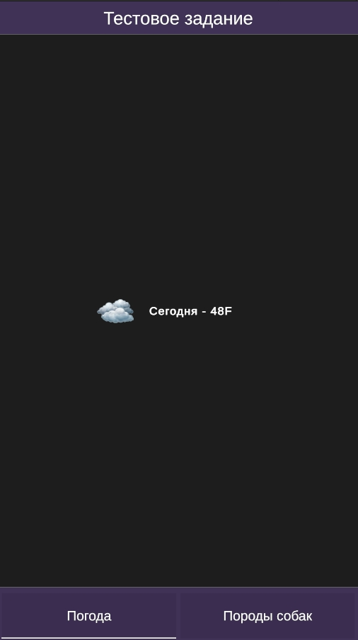

# Unity-разработчик | ПОРТФОЛИО

# Работы
1. EFTInvenotory (Матричный инвентарь (Учебный проект)) (2023г)

  [YouTube](https://www.youtube.com/watch?v=swgBI3nZD3c)

2. RTS (Учебный проект) (2023г)

    

3. Игра головоломка (сделана для HashStore и загружена туда) (2023г)

    
    
    
    
    

4. Учебный проект (2022г)

    

5. Тестовое задание (2025г)

  Zenject, UnityWebRequest, DOTween, MVC

    

  [GitHub](https://github.com/ZloyGreGan/Cifkor_TestTask)
