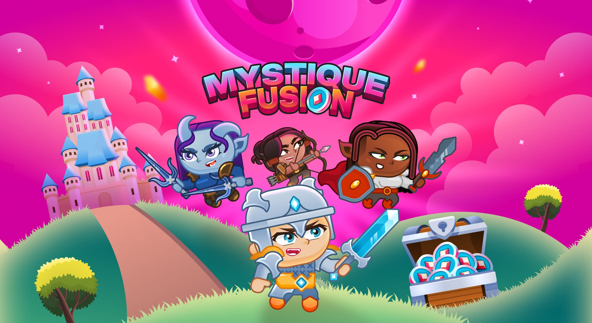

# 🔥 Mystique Fusion

## 📌 Краткое описание
**Mystique Fusion** — кликер в котором вы зарабатываете золото Mystique Gold, которое можно обменять на USDT, а затем использовать для покупки биткоина (BTC), Ethereum (ETH), Solana (SOL) и любой другой криптовалюты.

---

## 🚀 Платформы
- Android 
- IOS

---

## 🎮 Играбельная версия
👉 [Google Play](https://play.google.com/store/apps/details?id=com.CoinsCatch.MystiqueFusion)  
👉 [App Store](https://apps.apple.com/us/app/mystique-fusion-idle-clicker/id6670487126)  
👉 [Site](https://www.mystiquefusion.com)

---

## 🧠 Основные механики игры Mystique Fusion
- Таппинг (Core Mechanic)
- Коллекционирование и улучшение героев
- Квесты и задания
- Автономный прогресс (Idle-механика)
- Экономика и Play-to-Earn
- Соревновательные элементы
- Социальная интеграция
- Персонализация и настройки
  
---

## 🛠 Технологии
- Unity 2D (C#, UGUI, Addressables)
- DI: Zenject
- Асинхронность: UniTask, UnityWebRequest
- Анимации: DOTween
- Архитектура: MVP
- Управление задачами: Asana
- VCS: Git

---

## 👩‍💻 Мой вклад
- Разработка самой системы таппинга а в дальнейшем и системы автотаппинга;
- Разработка бизнеса (на +-70% реализовал всю логику бизнеса);
- Разработка системы локаций;
- Разработка настроек игры (локализация, звук, вибрация);
- Разработка почтового ящика (на него приходят награды, новости и разные уведомления);
- Разработка квестов, и календарей наград;
- Реализовал функционал "Оцени игру" с интеграцией в магазины приложений.
- Мною были пофикшены более 40% багов;
- Мною была оптимизирована игра, в результате чего я избавил игру от задержек со стороны бэка так и косяков со стороны фронта, и на +- 30% был уменьшен вес финального билда;
- Неоднократно писал код который стал фундаментом проекта (основным могу выделить: локализация, ui проекта, система нотификаций от бэка к клиенту)
- Реализовал множество мелких UI-меню и механик (настройки профиля, анимации переходов и т.п).

---

## 🏁 Вывод

Работа над Mystique Fusion стала для меня ценным опытом, который позволил углубить навыки разработки на Unity и решать сложные задачи в условиях реального проекта. В команде из 11 человек (4 из которых frontend программисты (в том числе и я)) я активно взаимодействовал с дизайнерами, бэкенд-разработчиками и QA, что научило меня эффективной коммуникации и синхронизации задач через Asana и Git.  

Были и сложности, возникали они при оптимизации производительности: задержки в запросах к бэкенду, высокий вес билда, множество багов, с этими задачами я боролся на протяжении всей разработки, и это замечательный опыт.  

Работа над проектом развила мои навыки в Unity, оптимизации и командной работе. Мой код стал основой для ключевых систем, а оптимизация улучшила производительность. Взаимодействие с командой научило эффективной коммуникации и адаптации к новым задачам.

---

## 📸 Скриншоты / Видео

