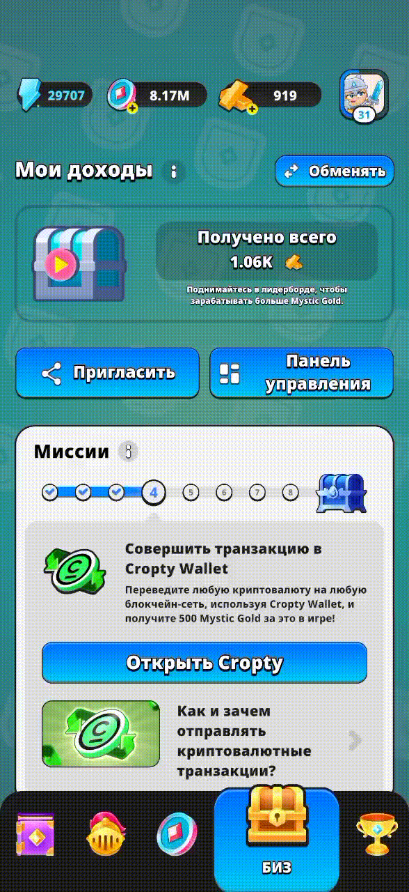

# 🔥 Mystique Fusion

## 📌 Краткое описание
**Mystique Fusion** — кликер в котором вы зарабатываете золото Mystique Gold, которое можно обменять на USDT, а затем использовать для покупки биткоина (BTC), Ethereum (ETH), Solana (SOL) и любой другой криптовалюты.

---

## 🚀 Платформы
- Android 
- IOS

---

## 🎮 Играбельная версия
👉 [Google Play](https://play.google.com/store/apps/details?id=com.CoinsCatch.MystiqueFusion)  
👉 [App Store](https://apps.apple.com/us/app/mystique-fusion-idle-clicker/id6670487126)  
👉 [Site](https://www.mystiquefusion.com)

---

## 🧠 Основные механики игры Mystique Fusion
- Таппинг (Core Mechanic)
- Коллекционирование и улучшение героев
- Квесты и задания
- Автономный прогресс (Idle-механика)
- Экономика и Play-to-Earn
- Соревновательные элементы
- Социальная интеграция
- Персонализация и настройки
  
---

## 🛠 Технологии
- Unity 2D (C#, UGUI, Addressables)
- DI: Zenject
- Асинхронность: UniTask, UnityWebRequest
- Анимации: DOTween
- Архитектура: MVP
- Управление задачами: Asana
- VCS: Git

---

## 👩‍💻 Мой вклад

- Разработал значительную часть бизнес-логики игры, включая:   
   -- игровую экономику (Play-to-Earn)   
   -- систему наград   
   -- календарные события   
   -- квестовую систему   
- Реализовал ключевые игровые механики (таппинг, автотаппинг, квестовая система)
- Оптимизировал проект, снизив размер финального билда на ~30%
- Оптимизировал асинхронное взаимодействие с backend-сервисами через UniTask и UnityWebRequest
- Реализовал систему локализации с поддержкой нескольких языков
- Разработал UI-системы (меню, настройки, почтовый ящик)
- Участвовал в код-ревью и рефакторинге legacy-кода
- Участвовал в подготовке релизов приложения для Google Play и App Store
- Исправлял баги в клиентской части, UI-сценариях, интеграции систем и пользовательских флоу на протяжении всего периода разработки.   

---

## 🏁 Вывод

Работа над Mystique Fusion стала для меня ценным опытом, который позволил углубить навыки разработки на Unity и решать сложные задачи в условиях реального проекта. В команде из 11 человек (5 из которых frontend программисты (в том числе и я)) я активно взаимодействовал с дизайнерами, бэкенд-разработчиками и QA, что научило меня эффективной коммуникации и синхронизации задач через Asana и Git.  

Были и сложности, возникали они при оптимизации производительности: задержки в запросах к бэкенду, высокий вес билда, множество багов, с этими задачами я боролся на протяжении всей разработки, и это замечательный опыт.  

---

## 📸 Скриншоты / Видео

